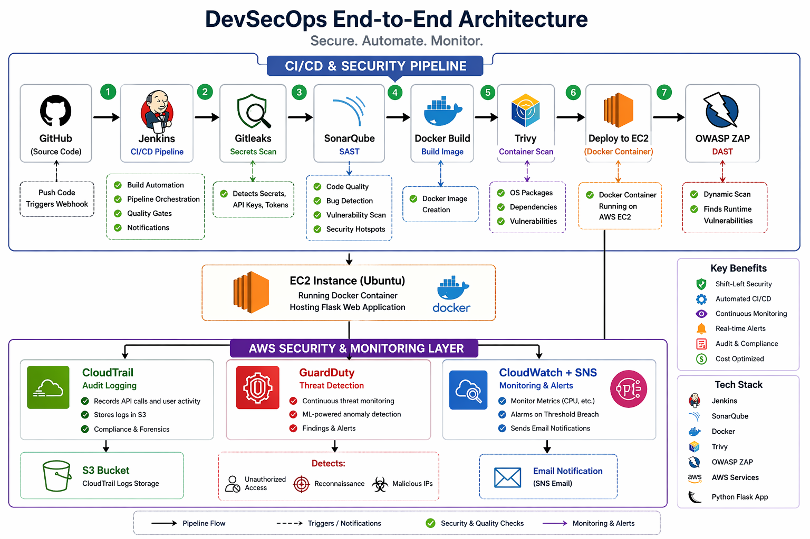

# 🚀 Enterprise Cloud-Native DevSecOps Platform


---

## 📌 Overview

This project demonstrates a **real-world DevSecOps pipeline** integrating:

- CI/CD automation  
- Security at every stage (Shift-Left + Runtime)  
- Cloud-native monitoring & threat detection  

Built on AWS with a focus on **practical implementation, debugging, and cost optimization**.

---

## 🧱 Architecture



---

## ⚙️ Tech Stack

### 🔹 CI/CD
- Jenkins  
- GitHub Webhooks  

### 🔹 Security Tools
- Gitleaks → Secrets Detection  
- SonarQube → SAST  
- Trivy → Container Scanning  
- OWASP ZAP → DAST  

### 🔹 Containerization
- Docker  

### 🔹 Cloud
- AWS EC2  
- AWS S3  

### 🔹 Monitoring & Security
- CloudTrail → Audit Logs  
- GuardDuty → Threat Detection  
- CloudWatch → Metrics  
- SNS → Alerts  

---

## 🔐 Security Implementation

✔ Secrets scanning before build  
✔ Static code analysis (SAST)  
✔ Container vulnerability scanning  
✔ Runtime security testing (DAST)  
✔ Secure Flask app (XSS protection, CSP headers)  
✔ Cloud-level monitoring and detection  

---

## 🚀 CI/CD Pipeline Flow

```text
GitHub → Jenkins → Gitleaks → SonarQube → Docker Build → Trivy → Deploy → OWASP ZAP
